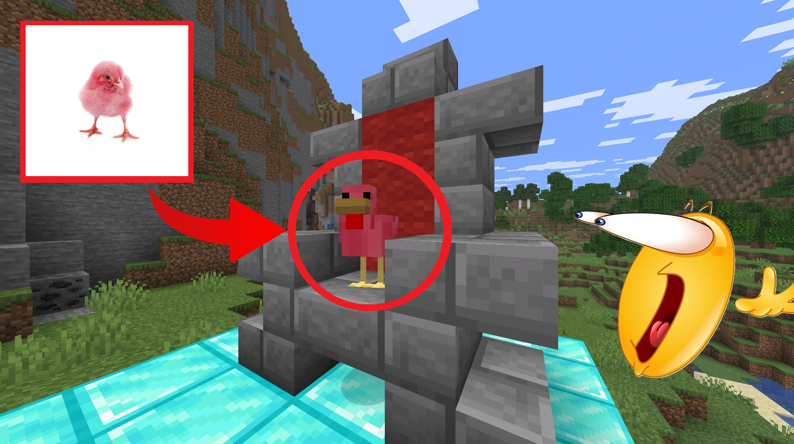
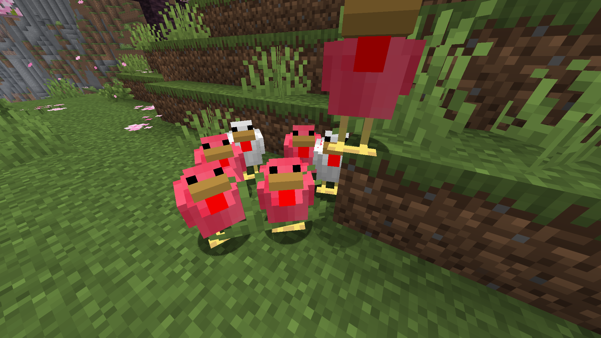
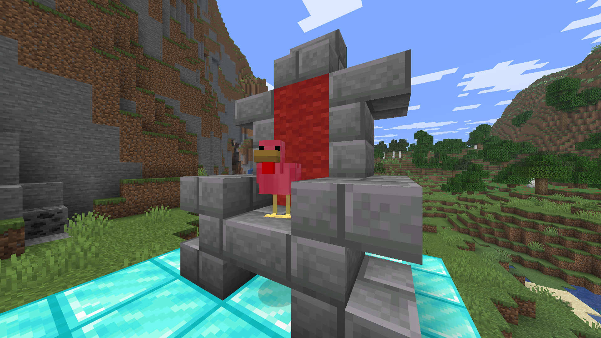
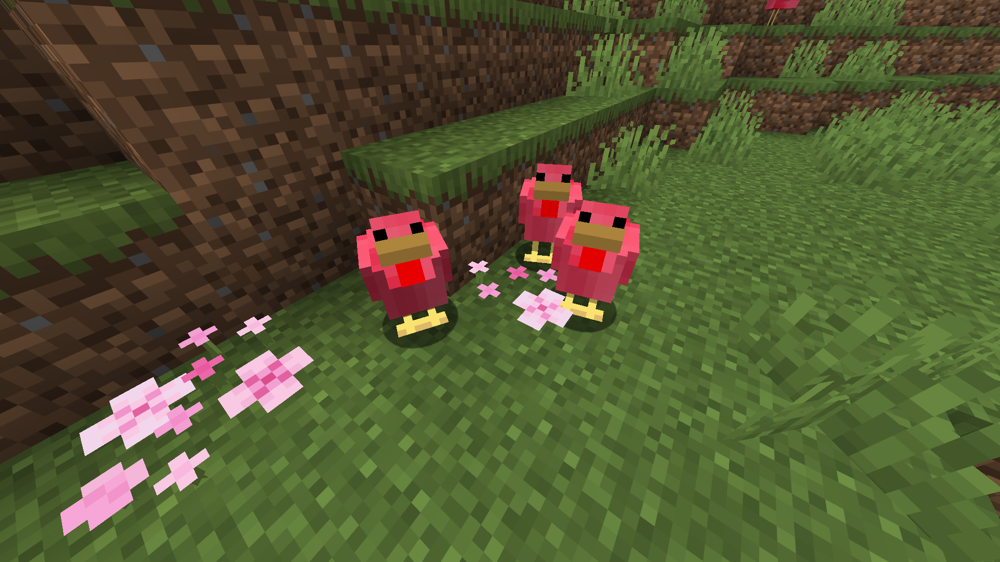

# Добавление розовых цып в Minecraft

Этот мод сохраняет сущность ванильную курицу и заменяет её, когда она переименовывается в **Cipochka** или **Цыпочка**.

## Что изменяет мод
Это не просто текстурпак, обычные курицы и цыплята остаются, но помимо этого добавляются мои обновленные версии
- взрослая курица переименована в `Cipochka` или `Цыпочка` -> моя модель взрослой курицы
- цыпленок переименован в `Cipochka` или `Цыпочка` -> моя модель цыпленка
- остальное в работе

## Примеры






## Версии и задействованные инструменты

- Minecraft: `1.21.11`
- Java: `21`
- Fabric Loader: `0.18.2`
- Fabric API: `0.139.4+1.21.11`
- Yarn mappings: `1.21.11+build.4`

## Build

Windows:

```bat
gradlew.bat build
```

macOS / Linux:

```bash
./gradlew build
```

Созданный jar будет помещен в `build/libs/`.

## Гайд

1. Установите Fabric для Майнкрафта `1.21.11`.
2. Поместите jar из `build/libs/` в вашу папку `mods`.
3. Запустите версию с Fabric.
4. Переименуйте курицу на `Cipochka` или `Цыпочка`.

## Текстуры

Текстуры делал тоже сам, так что ничего про них не могу сказать, если хотите - всегда их можно заменить.
- `src/main/resources/assets/cipochka/textures/entity/chicken/cipochka.png`
- `src/main/resources/assets/cipochka/textures/entity/chicken/cipochka_baby.png`

Можете дополнять мод, если хотите.
